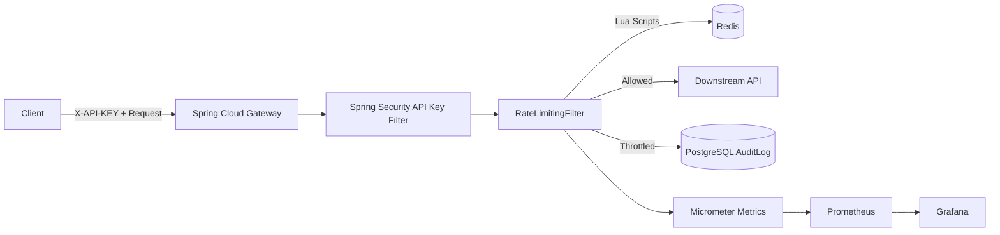

# RateFort: Production-Grade API Gateway & Rate Limiter

RateFort is a Spring Boot + Spring Cloud Gateway service that enforces distributed rate limits with Redis, secures API access with Spring Security API key authentication, persists throttle audit logs using Spring Data JPA, and exports observability metrics for Prometheus/Grafana.

## Key Features

- Request proxying to downstream services using Spring Cloud Gateway.
- Multiple rate limiting algorithms:
  - Token Bucket
  - Sliding Window Log
- Spring Security integration with API key validation via `SecurityWebFilterChain`.
- Per-throttle `AuditLog` persistence to PostgreSQL through Spring Data JPA.
- Async/scheduled stats flush (`@Async` + `@Scheduled`) for concurrent background processing.
- Prometheus metrics integration (`rate_limit_hits_total`, `rate_limit_throttles_total`).
- Maven `dev` and `prod` profiles for environment-specific behavior.
- Unit tests using JUnit 5 + Mockito + Reactor Test for limiter logic.

## Architecture Diagram



## Getting Started

### Prerequisites

- Java 17+
- Maven 3.9+
- Docker and Docker Compose
- PostgreSQL (local or containerized)
- Redis

### Run with Docker Compose

```bash
docker-compose up --build
```

Gateway base URL: `http://localhost:8080`

## Configuration

Core configuration lives in `src/main/resources/application.yml`.

### Security

Set allowed API keys (comma-separated):

```bash
export VALID_API_KEYS=my-secret-key,team-key-2
```

### Database (Audit Logs)

```bash
export DB_URL=jdbc:postgresql://localhost:5432/ratefort
export DB_USERNAME=ratefort
export DB_PASSWORD=ratefort
```

### Redis

```bash
export REDIS_HOST=localhost
export REDIS_PORT=6379
```

## Maven Profiles

- `dev` (default): `mvn clean test -Pdev`
- `prod`: `mvn clean verify -Pprod`

## Test Coverage

Run tests:

```bash
mvn clean test
```

Current tests include:

- `TokenBucketRateLimiterTest`
- `SlidingWindowRateLimiterTest`

These validate allowed/rejected limiter behavior by mocking Redis script outputs with Mockito.

## Manual API Verification

### Authenticated request

```bash
curl -i -H "X-API-KEY: my-secret-key" http://localhost:8080/api/posts/1
```

### Missing/invalid API key

```bash
curl -i http://localhost:8080/api/posts/1
```

Expected: `401 Unauthorized`

### Trigger throttling

```bash
for i in {1..11}; do curl -i -H "X-API-KEY: my-secret-key" http://localhost:8080/api/posts/1; done
```

Expected: final request returns `429 Too Many Requests` and creates an `audit_logs` DB row.

## Monitoring

Prometheus endpoint:

```bash
curl http://localhost:8080/actuator/prometheus
```

Look for:

- `rate_limit_hits_total`
- `rate_limit_throttles_total`

## GitHub Presentation Checklist

Add repository metadata:

- Description: `Production-grade API gateway with Redis-backed distributed rate limiting and Spring Security`
- Topics: `java`, `spring-boot`, `spring-cloud-gateway`, `redis`, `rate-limiting`, `prometheus`, `grafana`

If GitHub CLI is configured:

```bash
gh repo edit --description "Production-grade API gateway with Redis-backed distributed rate limiting and Spring Security" --add-topic java --add-topic spring-boot --add-topic spring-cloud-gateway --add-topic redis --add-topic rate-limiting --add-topic prometheus --add-topic grafana
```
